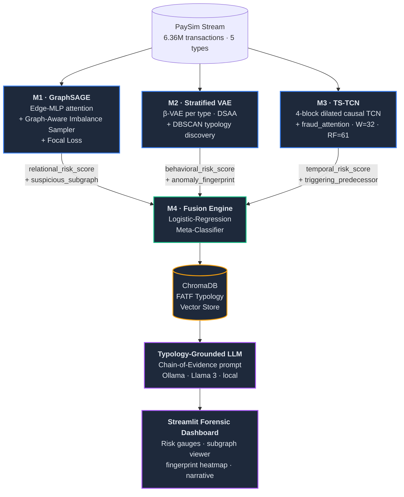

<div align="center">

# 🛡️ DeepSentinel

### A Cloud-Native Multi-Modal AI Platform for Explainable Financial Fraud Detection

**`R26-IT-121`** &nbsp;·&nbsp; B.Sc. (Hons) in Information Technology &nbsp;·&nbsp; SLIIT

[](#)
[](#-six-phase-execution-plan)
[](https://www.kaggle.com/datasets/ealaxi/paysim1)
[](#)
[](#)
[](#)
[](#)
[](#)
[](#-license)

**Supervised by Mrs. Anjalie Gamage** &nbsp;·&nbsp; Department of Information Technology, SLIIT

[Overview](#-overview) · [Team](#-team) · [Architecture](#%EF%B8%8F-architecture) · [Components](#-components) · [Stack](#%EF%B8%8F-tech-stack) · [Quick Start](#-quick-start) · [Plan](#%EF%B8%8F-six-phase-execution-plan)

</div>

---

## 📖 Overview

DeepSentinel is a cloud-native, multi-modal AI platform that detects organised financial fraud in mobile-money transactions and produces audit-traceable, legally defensible forensic reports. It attacks the two structural failures of conventional anti-money-laundering (AML) systems:

1. **Modal isolation** — single-signal models that evaluate transactions in strict isolation.
2. **The black-box problem** — opaque numerical scores that cannot legally justify an account freeze.

Three orthogonal deep-learning detectors analyse the same transaction stream through fundamentally different lenses — **relational topology**, **behavioural distribution**, and **temporal sequence** — and a **fusion engine** aggregates their outputs via a Logistic-Regression meta-classifier. The fused risk profile is then handed to a **typology-grounded LLM** that writes a narrative report citing specific mathematical evidence and documented FATF crime patterns through Retrieval-Augmented Generation (RAG).

The full pipeline is validated on the **PaySim** mobile-money simulator (6,362,620 synthetic transactions · 8,213 labelled frauds · 0.13% fraud rate), which contains no PII and requires no ethical review.

> **Research alignment:** UN SDG 16, Target 16.4 (reduction of illicit financial flows) &nbsp;·&nbsp; SLIIT Centre of Excellence for AI (CoEAI).

---

## 👥 Team

| | Member | Student ID | Component | Folder |
|:-:|---|---|---|---|
| **M1** | Ewaduge S.B. | `IT22217936` | Edge-Enhanced GraphSAGE — *relational topology* | [`GraphSage/`](./GraphSage) |
| **M2** | Wijesinghe L.P.D.B. | `IT22109194` | Stratified VAE with DSAA — *behavioural anomaly* | [`VAE-With-DSAA/`](./VAE-With-DSAA) |
| **M3** | Pathirana P.K.V. | `IT22237972` | TS-TCN with `fraud_attention` — *temporal sequence* | [`TS-TCN/`](./TS-TCN) |
| **M4** | Vidanaarachchi T.M. | `IT22192882` | Fusion Engine + RAG-LLM Forensic Reporter | [`Fusion_Engine`](https://github.com/R26-IT-121/Fusion_Engine) ↗ |

The shared cross-component key is the PaySim column **`nameOrig`**. The canonical train/test split is fixed at **step 595** to preserve strict temporal ordering across all four components.

---

## 🏗️ Architecture



Each detector exposes a FastAPI `/api/v1/classify` endpoint. The fusion engine fans the same payload out to all three via `asyncio.gather` with a **2-second per-call timeout**. Missing modalities are flagged in the final report rather than blocking the pipeline.

---

## 🧩 Components

### M1 · Edge-Enhanced GraphSAGE &nbsp;·&nbsp; [`GraphSage/`](./GraphSage)

> Standard GraphSAGE aggregates neighbours with a mean operator, treating every transaction edge as equally informative. M1 fixes this with two architectural upgrades.

| Item | Detail |
|---|---|
| **Core** | Inductive GraphSAGE with a custom **Edge-MLP** attention layer computing dynamic weights per edge from normalised transfer amount and inter-arrival time. |
| **Imbalance** | **Graph-Aware Imbalance Sampler** + Focal Loss — preserves the topological shape of fraud motifs that SMOTE-style resampling would destroy. |
| **Output** | `relational_risk_score` + an explainable **Suspicious Subgraph** (specific implicated accounts and edges). |
| **Ablation** | (1) Baseline GraphSAGE → (2) + Edge-MLP → (3) Full system with Graph-Aware Imbalance Sampler. |
| **Stack** | PyTorch 2.1.2 · PyTorch Geometric 2.4.0 · NetworkX · FastAPI |

### M2 · Stratified VAE with DSAA &nbsp;·&nbsp; [`VAE-With-DSAA/`](./VAE-With-DSAA)

> Existing VAE fraud detectors train one global model and collapse output to a single scalar — discarding both signals the architecture provides natively. M2 reverses both decisions.

| Item | Detail |
|---|---|
| **Stratification** | One β-VAE per major transaction type (PAYMENT, TRANSFER, CASH_OUT). Each learns type-specific normal behaviour, eliminating cross-type false positives. |
| **DSAA** | **Dual-Signal Anomaly Attribution** — decomposes reconstruction error **per input feature** (Signal 1) + KL divergence **per latent dimension** (Signal 2) into a two-level **Anomaly Fingerprint**. |
| **Typology discovery** | **DBSCAN** on 16-dim fingerprint vectors surfaces distinct fraud typologies (account-draining, balance-inconsistency, mule) **without supervision**. |
| **Features** | 8 engineered features (log amount, amount/balance ratio, balance consistency, destination ratio, hour, day, P95 large flag). |
| **Stack** | TensorFlow 2.x / Keras (β-annealing + Free Bits) · scikit-learn · FastAPI · Colab Pro GPU |
| **Ablation** | 7-configuration study (global vs stratified · global vs per-type thresholds · F3 feature-necessity tests). |

### M3 · TS-TCN with `fraud_attention` &nbsp;·&nbsp; [`TS-TCN/`](./TS-TCN)

> Per-account sequence models fail on PaySim — the mean transactions per originator is 1.0. Step-aggregate approaches average the signal away. M3 introduces a system-wide sliding window that needs no per-account history.

| Item | Detail |
|---|---|
| **Core** | Four-block dilated causal TCN with dilations **1, 2, 4, 8** — receptive field of 61 transactions, fully covering W=32. |
| **Window justification** | W=32 chosen empirically (mean 2.22 frauds cluster inside each 32-window preceding a fraud event) **and** architecturally (RF=61 ≥ W=32). |
| **`fraud_attention`** | Self-attention layer that identifies the **single most predictive preceding transaction** and returns its **full feature vector** — not just an index — as forensic evidence for M4's LLM. |
| **Features** | 10 universally valid features from raw PaySim fields only. Includes data-driven type-risk weights from training-set fraud prevalence. **Zero PaySim-specific artifact columns.** |
| **Imbalance** | `BinaryFocalCrossentropy(γ=2.0)` — handles the 773:1 ratio at the loss level (SMOTE incompatible with 3-D sequence tensors). |
| **Output** | `temporal_risk_score`, `risk_level`, `transaction_ref` (`nameOrig`, `composite_id`), structured evidence summary, `triggering_predecessor` block with peak-attention `nameOrig` + features. |
| **Baselines** | Three progressive baselines on identical flat features: `isFlaggedFraud` rule → Logistic Regression → MLP. |
| **Ablation** | 4 configurations: W=16, W=32 (primary), W=64, TS-TCN without `fraud_attention`. |
| **Targets** | F1 > 0.88 · AUC-ROC > 0.97 · Recall > 0.90 |
| **Stack** | TensorFlow 2.x / Keras · FastAPI 0.109.2 |

### M4 · Fusion Engine + RAG-LLM Forensic Reporter &nbsp;·&nbsp; [`Fusion_Engine`](https://github.com/R26-IT-121/Fusion_Engine)

> M4 orchestrates the three detectors and converts their numerical outputs into a legally defensible narrative — engineered as an independent decision layer, not a thin LLM wrapper.

| Item | Detail |
|---|---|
| **Meta-classifier** | **Logistic-Regression stacking layer** trained on PaySim validation split to learn per-modality weights for the unified Fraud Confidence Score. |
| **RAG layer** | **ChromaDB** vector store of structured **FATF fraud typologies** (Smurfing, Layering, ATO, mule networks). Fused risk profile → semantic query → cosine-similarity match. |
| **LLM** | **Ollama** (Llama 3, local) — no transaction data leaves the pipeline. |
| **Chain-of-Evidence prompt** | Constrains the LLM to construct narratives **strictly from** upstream findings + retrieved FATF context. Eliminates hallucination. |
| **Orchestration** | `asyncio.gather` with 2-second timeout per upstream call; missing modalities flagged, not silently dropped. |
| **Dashboard** | Six-panel Streamlit + Plotly forensic dashboard. |
| **Ablation** | Pure-prompt vs RAG-grounded reports scored against a **Legal Admissibility Rubric** — any output inventing transaction details or failing to cite retrieved FATF context fails. |

---

## 📊 Dataset

| Property | Value |
|---|---|
| Source | [PaySim Mobile-Money Simulator](https://www.kaggle.com/datasets/ealaxi/paysim1) (Lopez-Rojas et al., 2016) |
| Total transactions | **6,362,620** |
| Fraud transactions | **8,213** (0.13%) |
| Fraud concentration | TRANSFER, CASH_OUT only |
| Simulation length | 743 hourly steps |
| Canonical split | Time-based at **step 595** (no future leakage into any window) |
| Shared cross-component key | `nameOrig` |
| Ethical clearance | Not required — fully synthetic, no PII |

---

## 🛠️ Tech Stack

```yaml
language:         Python 3.10
deep_learning:    PyTorch 2.1.2  ·  PyTorch Geometric 2.4.0  ·  TensorFlow 2.x / Keras
classical_ml:     scikit-learn  ·  NumPy  ·  Pandas
graph:            NetworkX
api:              FastAPI 0.109.2  +  Pydantic
vector_store:     ChromaDB
llm_runtime:      Ollama (Llama 3)
dashboard:        Streamlit  +  Plotly
containerisation: Docker  ·  docker-compose
training_env:     Google Colab Pro (GPU)
vcs:              Git  ·  GitFlow branching (m1/, m2/, m3/, m4/)
```

---

## 📂 Repository Layout

```
R26-IT-121/
├── GraphSage/              # M1 — Edge-Enhanced GraphSAGE
│   ├── notebooks/
│   ├── src/
│   ├── models/
│   ├── api/
│   └── README.md
├── VAE-With-DSAA/          # M2 — Stratified VAE + DSAA + Typology Discovery
│   ├── notebooks/
│   ├── src/
│   ├── models/
│   ├── api/
│   └── README.md
├── TS-TCN/                 # M3 — Transaction-Sequence TCN + fraud_attention
│   ├── notebooks/
│   ├── src/
│   ├── models/
│   ├── api/
│   └── README.md
├── docs/                   # Shared proposal documents, API contract, diagrams
├── docker-compose.yml      # End-to-end orchestration (Phase 5)
└── README.md               # ← you are here
```

> **Note:** [`Fusion_Engine`](https://github.com/R26-IT-121/Fusion_Engine) lives in a separate repository under the `R26-IT-121` organisation and is composed in at integration time via `docker-compose`.

---

## 🔌 Shared API Contract

Every detector exposes the same `POST /api/v1/classify` endpoint and returns a Pydantic-validated JSON payload. The contract is **locked** for the duration of Phase 2 to enable parallel development.

```jsonc
{
  "transaction_ref": {
    "nameOrig":     "C1231006815",
    "composite_id": "C1231006815_1"
  },
  "risk_score":  0.87,           // [0.0, 1.0]
  "risk_level":  "CRITICAL",     // NORMAL | SUSPICIOUS | CRITICAL
  "evidence":    { /* component-specific structured fields */ },
  "version":     "1.0.0"
}
```

Component-specific `evidence` blocks:

| Component | `evidence` content |
|---|---|
| M1 | `suspicious_subgraph` — implicated account IDs + edges |
| M2 | `anomaly_fingerprint` — Signal 1 (per-feature) + Signal 2 (per-latent-dim) + typology label |
| M3 | `triggering_predecessor` — peak-attention `nameOrig` + full feature vector |
| M4 | `fused_confidence_score` + `forensic_narrative` + `retrieved_typology` |

---

## 🚀 Quick Start

> Full end-to-end orchestration ships in Phase 5. Until then, each component can be run standalone via its own `README.md`.

```bash
# Clone the monorepo
git clone https://github.com/LEXES7/R26-IT-121.git
cd R26-IT-121

# Clone M4 alongside (separate repo)
git clone https://github.com/R26-IT-121/Fusion_Engine.git

# Run a single component (example: M3)
cd TS-TCN
pip install -r requirements.txt
uvicorn api.main:app --reload --port 8003
```

**Phase 5 (planned):**

```bash
docker-compose up -d   # spins up M1, M2, M3, M4, ChromaDB, Ollama, Streamlit
open http://localhost:8501
```

---

## 🗓️ Six-Phase Execution Plan

| Phase | Window | Focus |
|:-:|---|---|
| **1** | Apr 2026 | Monorepo bootstrap · API contract lock · pinned dependencies · GitFlow branches (`m1/`–`m4/`) |
| **2** | May – Jun 2026 | Parallel component development against the locked contract using FastAPI mock-mode |
| **3** | Jul 2026 | Per-component ablation studies (M1: 3-way · M2: 7-way · M3: 4-way · M4: legal-admissibility) |
| **4** | Aug 2026 | End-to-end integration · `asyncio.gather` orchestration · meta-classifier training |
| **5** | Sep 2026 | Streamlit dashboard · Docker / docker-compose packaging · load testing |
| **6** | Oct 2026 | Final report · demo prep · viva submission |

---

## 📚 Selected References

1. Lopez-Rojas, E. A., Elmir, A., & Axelsson, S. (2016). *PaySim: A Financial Mobile Money Simulator for Fraud Detection.* EMSS.
2. Hamilton, W. L., Ying, R., & Leskovec, J. (2017). *Inductive Representation Learning on Large Graphs.* NeurIPS.
3. Kingma, D. P. & Welling, M. (2014). *Auto-Encoding Variational Bayes.* ICLR.
4. Bai, S., Kolter, J. Z., & Koltun, V. (2018). *An Empirical Evaluation of Generic Convolutional and Recurrent Networks for Sequence Modeling.*
5. Lin, T.-Y., Goyal, P., Girshick, R., He, K., & Dollár, P. (2017). *Focal Loss for Dense Object Detection.* ICCV.
6. Vaswani, A. et al. (2017). *Attention Is All You Need.* NeurIPS.
7. Lewis, P. et al. (2020). *Retrieval-Augmented Generation for Knowledge-Intensive NLP Tasks.* NeurIPS.

> Full reference lists are maintained inside each component's proposal document under [`docs/`](./docs).

---

## 📄 License

This work is conducted as the undergraduate dissertation of group **`R26-IT-121`** under the supervision of **Mrs. Anjalie Gamage**, Department of Information Technology, Sri Lanka Institute of Information Technology.

Released for academic and research use. Commercial use requires written permission from the authors and SLIIT.

---

## 🙏 Acknowledgements

The four authors acknowledge:

- **Mrs. Anjalie Gamage** for her supervision, technical insight, and continuous feedback.
- The **Department of Information Technology, SLIIT** for providing the institutional and computational facilities.
- The **SLIIT Centre of Excellence for AI (CoEAI)** for research alignment and academic support.
- The creators of the **PaySim** dataset for a research-grade, ethically clean financial simulator.

---

<div align="center">

**DeepSentinel** &nbsp;·&nbsp; *From numerical guessing to actionable, structural intelligence.*

Made with ☕ at SLIIT &nbsp;·&nbsp; March – October 2026

</div>